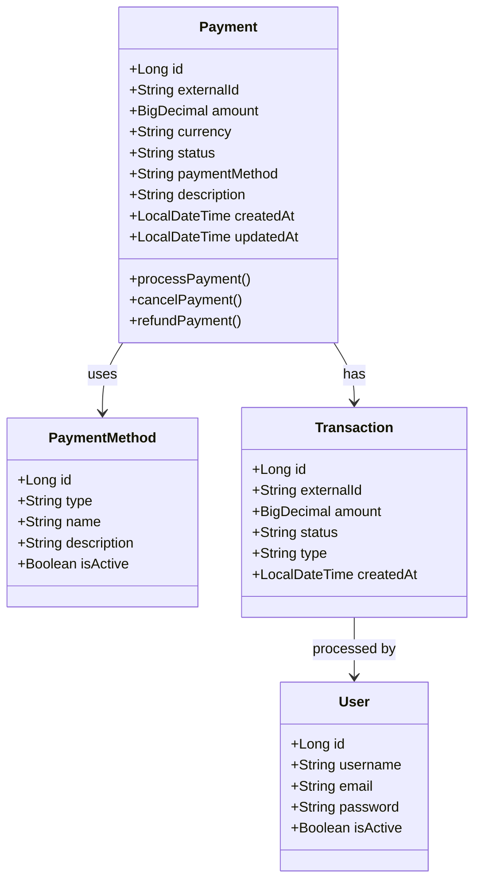
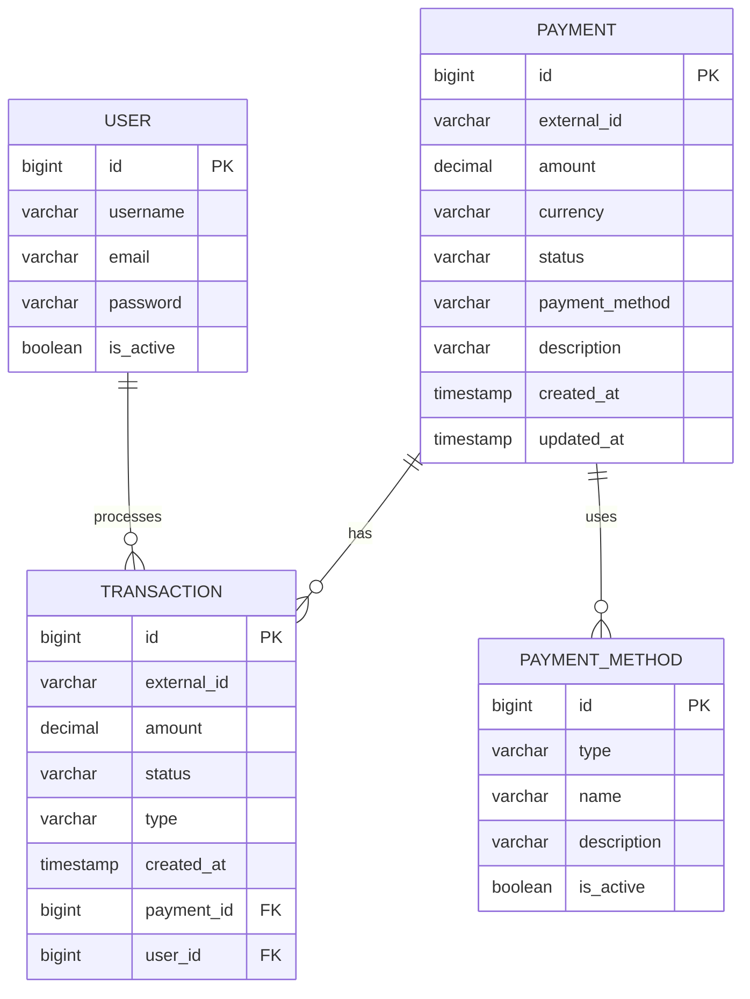

# Documentação do Estado Atual - WiPay Gateway

## 📊 Diagramas Atualizados

### Diagrama de Classes (UML)

### Diagrama Entidade-Relacionamento (MER)

## 🔄 Estado Atual do Projeto

### Backend (Java API)
- ✅ Configuração inicial do Spring Boot
- ✅ Integração com PostgreSQL
- ✅ Configuração do Swagger/OpenAPI
- ✅ Estrutura base do projeto
- ✅ Configuração de segurança com Keycloak
- ✅ Documentação básica

### Frontend (React)
- ✅ Configuração inicial do React
- ✅ Estrutura base do projeto
- ✅ Integração com a API

### Infraestrutura
- ✅ Docker Compose configurado
- ✅ Banco de dados PostgreSQL
- ✅ Keycloak para autenticação
- ✅ RabbitMQ para mensageria

## 📝 Atualizações Realizadas

1. **Documentação**
   - Adicionados diagramas UML e MER
   - Atualizada documentação de endpoints
   - Criada licença MIT

2. **Endpoints**
   - Documentados endpoints de pagamento
   - Adicionada documentação Swagger
   - Configurada autenticação

3. **Estrutura do Projeto**
   - Organização de diretórios
   - Configuração de dependências
   - Setup de ambiente de desenvolvimento

## 🚀 Próximos Passos

1. **Backend**
   - Implementar endpoints de pagamento
   - Adicionar testes unitários
   - Configurar monitoramento

2. **Frontend**
   - Desenvolver interfaces de usuário
   - Implementar autenticação
   - Integrar com API

3. **Infraestrutura**
   - Configurar CI/CD
   - Implementar monitoramento
   - Configurar ambientes de homologação e produção

## 📋 Checklist de Tarefas

- [ ] Implementar endpoints de pagamento
- [ ] Desenvolver interfaces do frontend
- [ ] Configurar monitoramento
- [ ] Implementar testes
- [ ] Configurar CI/CD
- [ ] Documentar processos de deploy
- [ ] Configurar ambientes de homologação e produção

## 🔐 Segurança

- Autenticação via Keycloak
- HTTPS em todos os ambientes
- Rate limiting por IP
- Validação de entrada em todos os endpoints
- Sanitização de dados
- Auditoria de operações sensíveis

## 📊 Monitoramento

- Logs: ELK Stack
- Métricas: Prometheus + Grafana
- Alertas: PagerDuty

## 📝 Notas

Este documento será atualizado conforme o desenvolvimento do projeto avança. Ao final do desenvolvimento, todo o conteúdo será compilado em um README.md completo e final. 