# Gateway de Pagamentos - WiPay

## Configuração do Ambiente

### Pré-requisitos

- Docker Desktop
- Java 17+
- Maven
- Insomnia ou Postman

### Configuração de Variáveis de Ambiente

O projeto utiliza variáveis de ambiente para configurações sensíveis. Siga os passos abaixo:

1. Copie o arquivo `.env.example` para `.env`:

   ```bash
   cp .env.example .env
   ```

2. Edite o arquivo `.env` com suas configurações:

   ```bash
   # Configurações do Banco de Dados
   DB_HOST=localhost
   DB_PORT=5432
   DB_NAME=wipay
   DB_USER=postgres
   DB_PASSWORD=sua_senha_segura

   # Configurações do RabbitMQ
   SPRING_RABBITMQ_HOST=localhost
   SPRING_RABBITMQ_PORT=5672
   SPRING_RABBITMQ_USERNAME=guest
   SPRING_RABBITMQ_PASSWORD=guest

   # Configurações do Keycloak
   KEYCLOAK_ADMIN=admin
   KEYCLOAK_ADMIN_PASSWORD=sua_senha_admin
   KC_DB_PASSWORD=sua_senha_db_keycloak
   POSTGRES_PASSWORD=sua_senha_postgres

   # Configurações do Gateway
   GATEWAY_CLIENT_ID=gateway
   GATEWAY_CLIENT_SECRET=seu_client_secret

   # Configurações dos Provedores de Pagamento
   PAYPAL_CLIENT_ID=seu_client_id_paypal
   PAYPAL_CLIENT_SECRET=seu_client_secret_paypal
   STRIPE_API_KEY=sua_chave_stripe
   CIELO_MERCHANT_ID=seu_merchant_id_cielo
   CIELO_MERCHANT_KEY=sua_chave_cielo
   ```

3. Importante:
   - Nunca compartilhe ou comite o arquivo `.env`
   - Mantenha o `.env.example` atualizado com novas variáveis
   - Use senhas fortes e únicas para cada ambiente
   - Em produção, considere usar um gerenciador de segredos

### Estrutura do Projeto

```
java-api/
├── src/
│   ├── main/
│   │   ├── java/
│   │   │   └── com/
│   │   │       └── wipay/
│   │   │           └── gateway/
│   │   │               ├── config/
│   │   │               │   ├── SecurityConfig.java
│   │   │               │   └── SwaggerConfig.java
│   │   │               ├── controller/
│   │   │               │   └── PaymentController.java
│   │   │               ├── dto/
│   │   │               │   ├── PaymentRequest.java
│   │   │               │   └── PaymentResponse.java
│   │   │               ├── model/
│   │   │               │   └── PaymentTransaction.java
│   │   │               ├── provider/
│   │   │               │   ├── CieloProvider.java
│   │   │               │   ├── PayPalProvider.java
│   │   │               │   └── StripeProvider.java
│   │   │               ├── repository/
│   │   │               │   └── PaymentTransactionRepository.java
│   │   │               ├── service/
│   │   │               │   └── PaymentService.java
│   │   │               └── GatewayApplication.java
│   │   └── resources/
│   │       ├── application.yml
│   │       ├── application-dev.yml
│   │       └── db/
│   │           └── migration/
│   │               └── V1__create_tables.sql
│   └── test/
│       └── java/
│           └── com/
│               └── wipay/
│                   └── gateway/
├── keycloak/
│   ├── realm-export.json
│   └── keycloak-compose.yml
├── image-doc-wipay/
│   └── [arquivos de documentação visual]
├── .vscode/
│   └── [configurações do VS Code]
├── .idea/
│   └── [configurações do IntelliJ]
├── target/
│   └── [arquivos compilados]
├── .gitignore
├── .env.example
├── docker-compose.yml
├── Dockerfile
├── Endpoints.md
├── insomnia-config.json
├── pom.xml
├── prometheus.yml
└── sonar-project.properties
```

## Configuração do Keycloak

### 1. Iniciar o Keycloak

```bash
cd keycloak
docker compose -f keycloak-compose.yml up -d
```

O Keycloak estará disponível em: `http://localhost:8180`

### 2. Configurações Realizadas

- **Realm**: gateway
- **Cliente**: gateway-client
  - Client authentication: ON
  - Authorization: ON
  - Standard flow: ON
  - Direct access grants: ON

#### URLs Configuradas

- Root URL: `http://localhost:8080`
- Home URL: `http://localhost:8080/api`
- Valid redirect URIs:
  ```
  http://localhost:8080/*
  http://localhost:8180/*
  http://localhost:3000/*
  ```
- Valid post logout redirect URIs:
  ```
  http://localhost:8080/*
  http://localhost:3000/*
  ```
- Web origins:
  ```
  http://localhost:8080
  http://localhost:3000
  +
  ```

## Autenticação

### Obter Token (Insomnia)

```
POST http://localhost:8180/realms/gateway/protocol/openid-connect/token
```

Headers:

```
Content-Type: application/x-www-form-urlencoded
```

Body (x-www-form-urlencoded):

```
grant_type: password
client_id: gateway-client
client_secret: [SEU_CLIENT_SECRET]
username: admin
password: admin
```

## Próximos Passos

### 1. Configuração de Roles

- [ ] Criar role `payments:write`
- [ ] Criar role `payments:read`
- [ ] Atribuir roles ao usuário admin

### 2. Configuração da API

- [ ] Implementar endpoints de pagamento
- [ ] Configurar segurança com JWT
- [ ] Implementar validações de roles

### 3. Integrações

- [ ] Configurar Cielo
- [ ] Configurar PayPal
- [ ] Configurar Stripe

### 4. Monitoramento

- [ ] Configurar Prometheus
- [ ] Configurar Grafana
- [ ] Implementar logs estruturados

### 5. Testes

- [ ] Implementar testes unitários
- [ ] Implementar testes de integração
- [ ] Configurar pipeline CI/CD

## Portas Utilizadas

- 8080: API Gateway
- 8180: Keycloak
- 5432: PostgreSQL Principal
- 5433: PostgreSQL Keycloak
- 5672: RabbitMQ
- 15672: RabbitMQ Management
- 9090: Prometheus
- 3000: Grafana

## Documentação Adicional

- [Endpoints da API](Endpoints.md)
- [Swagger UI](http://localhost:8080/api/swagger-ui.html)
- [Keycloak Admin Console](http://localhost:8180)

## Ambiente de Desenvolvimento

### Docker Compose

O projeto utiliza múltiplos arquivos docker-compose:

- `docker-compose.yml`: Serviços principais (API, DB, RabbitMQ, etc.)
- `keycloak/keycloak-compose.yml`: Keycloak e seu banco de dados

### Variáveis de Ambiente

Configure as seguintes variáveis:

- `STRIPE_API_KEY`
- Outras variáveis conforme necessário

## Troubleshooting

### Keycloak

- Se o token não estiver funcionando, verificar:
  1. Client Secret
  2. Configurações do cliente no Keycloak
  3. Roles e permissões

### Docker

- Certifique-se que o Docker Desktop está rodando
- Use o terminal do Docker Desktop para comandos docker
- Verifique logs: `docker compose logs -f`

## Contribuição

1. Clone o repositório
2. Crie uma branch para sua feature
3. Faça commit das alterações
4. Abra um Pull Request

## Licença

[Adicionar informações de licença]

## Documentação Visual

### Configuração do Ambiente

#### Docker

<div style="text-align: center;">
    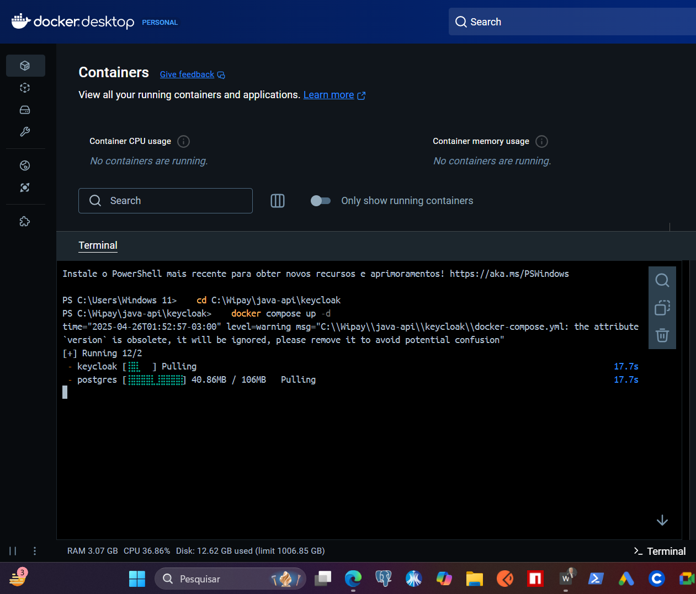
    <p><em>Configuração do ambiente Docker para desenvolvimento</em></p>
</div>

#### Keycloak

<div style="text-align: center;">
    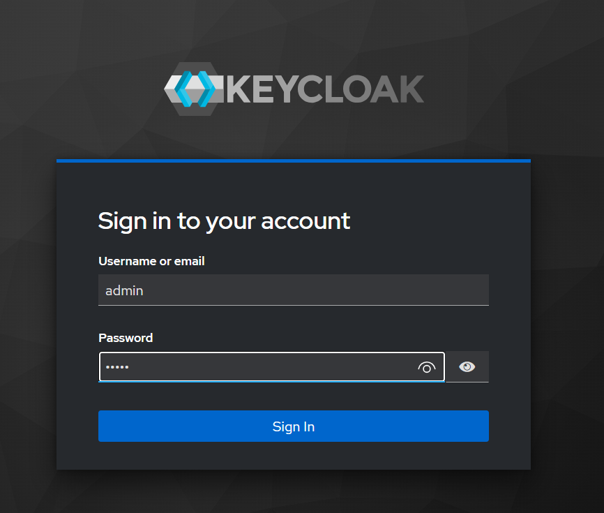
    <p><em>Interface do Keycloak para gerenciamento de autenticação</em></p>
</div>

### Configurações do Keycloak

#### Realm e Cliente

<div style="text-align: center;">
    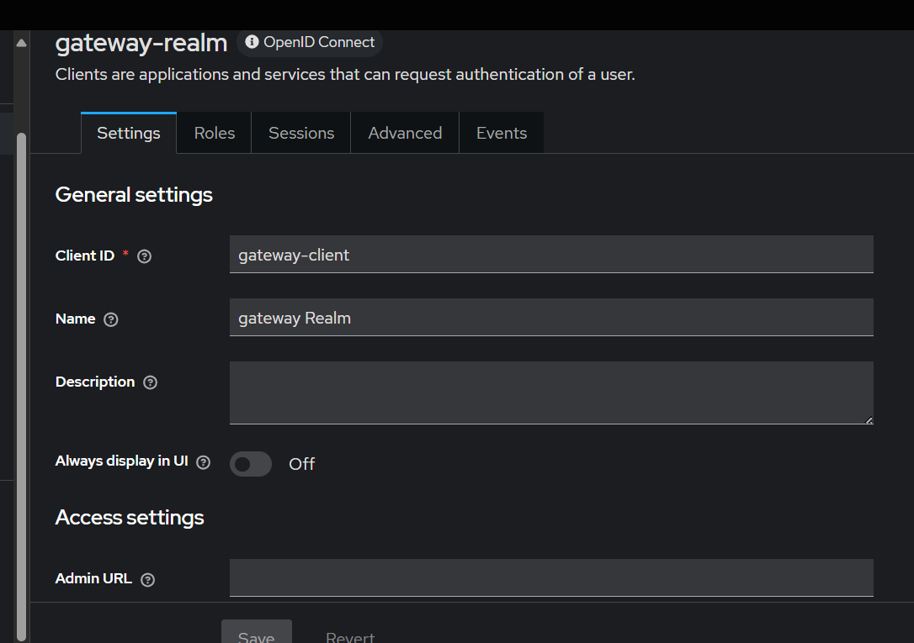
    <p><em>Configuração do Realm gateway</em></p>
</div>

<div style="text-align: center;">
    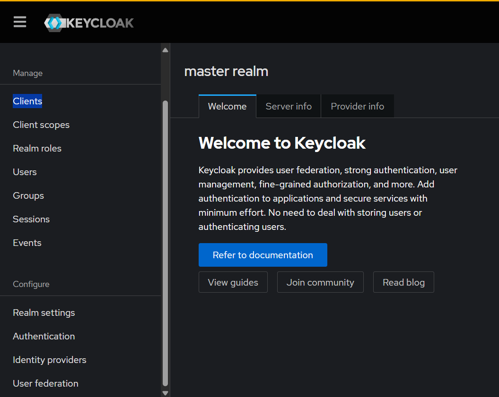
    <p><em>Configuração do cliente gateway-client</em></p>
</div>

#### Roles e Permissões

<div style="text-align: center;">
    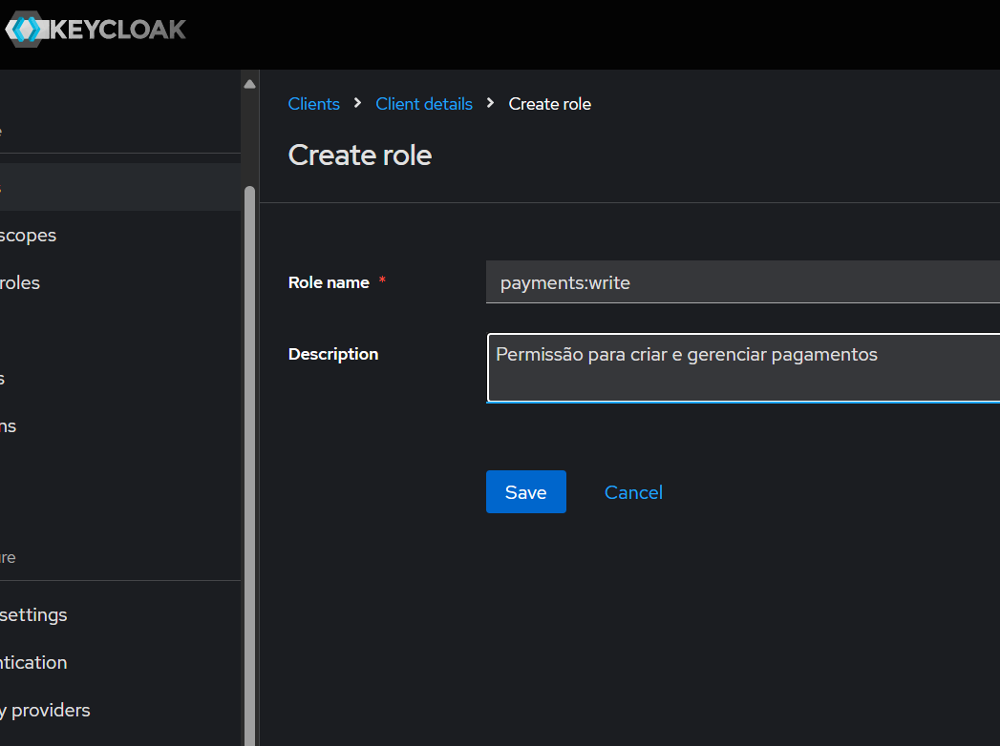
    <p><em>Configuração de roles para o cliente</em></p>
</div>

#### Credenciais

<div style="text-align: center;">
    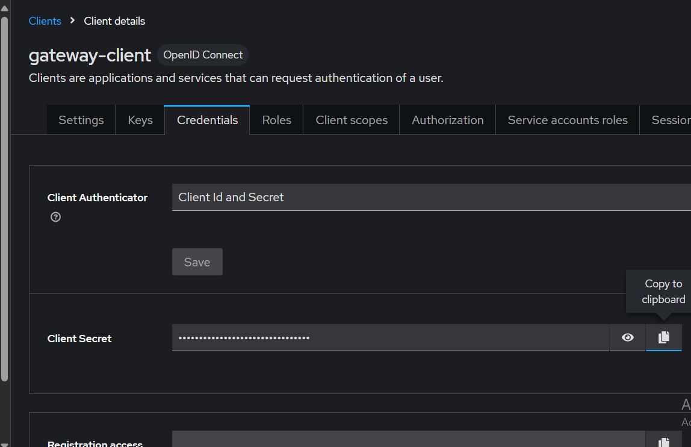
    <p><em>Configuração de client_id e client_secret</em></p>
</div>

### Endpoints e Documentação

#### Swagger

<div style="text-align: center;">
    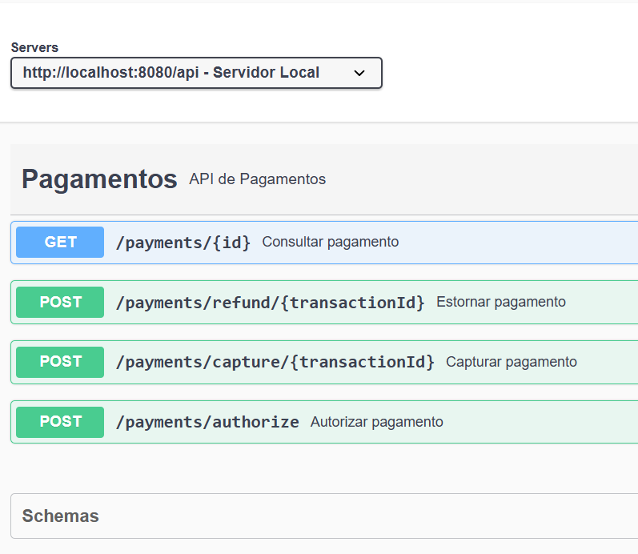
    <p><em>Documentação dos endpoints no Swagger</em></p>
</div>

#### Endpoints de Pagamento

##### Autorização

<div style="text-align: center;">
    
    <p><em>Endpoint para autorização de pagamento</em></p>
</div>

<div style="text-align: center;">
    
    <p><em>Respostas de sucesso para autorização</em></p>
</div>

<div style="text-align: center;">
    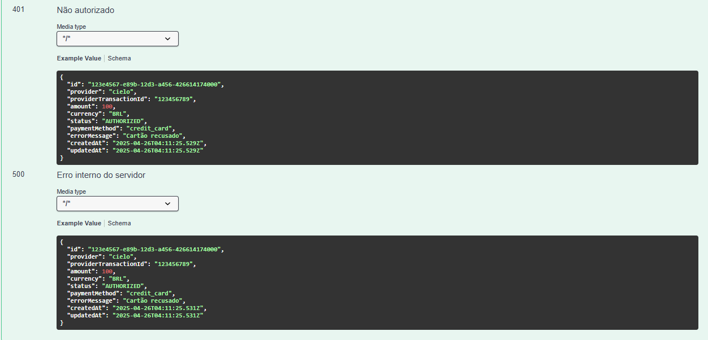
    <p><em>Respostas de erro para autorização</em></p>
</div>

##### Captura

<div style="text-align: center;">
    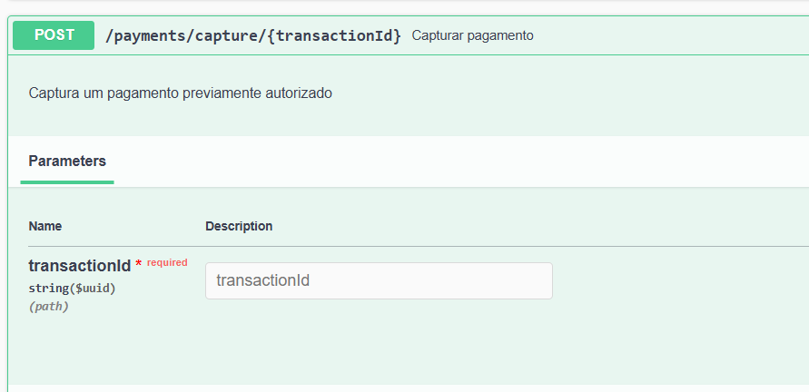
    <p><em>Endpoint para captura de pagamento</em></p>
</div>

<div style="text-align: center;">
    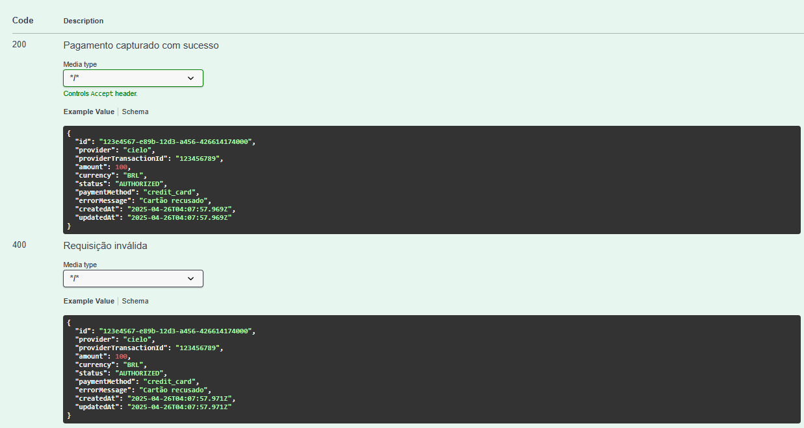
    <p><em>Respostas de sucesso para captura</em></p>
</div>

<div style="text-align: center;">
    
    <p><em>Respostas de erro para captura</em></p>
</div>

##### Reembolso

<div style="text-align: center;">
    
    <p><em>Endpoint para reembolso de pagamento</em></p>
</div>

<div style="text-align: center;">
    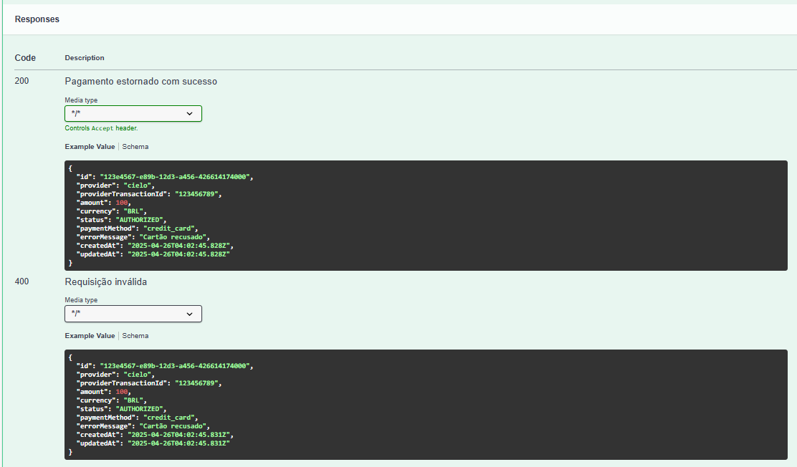
    <p><em>Respostas de sucesso para reembolso</em></p>
</div>

<div style="text-align: center;">
    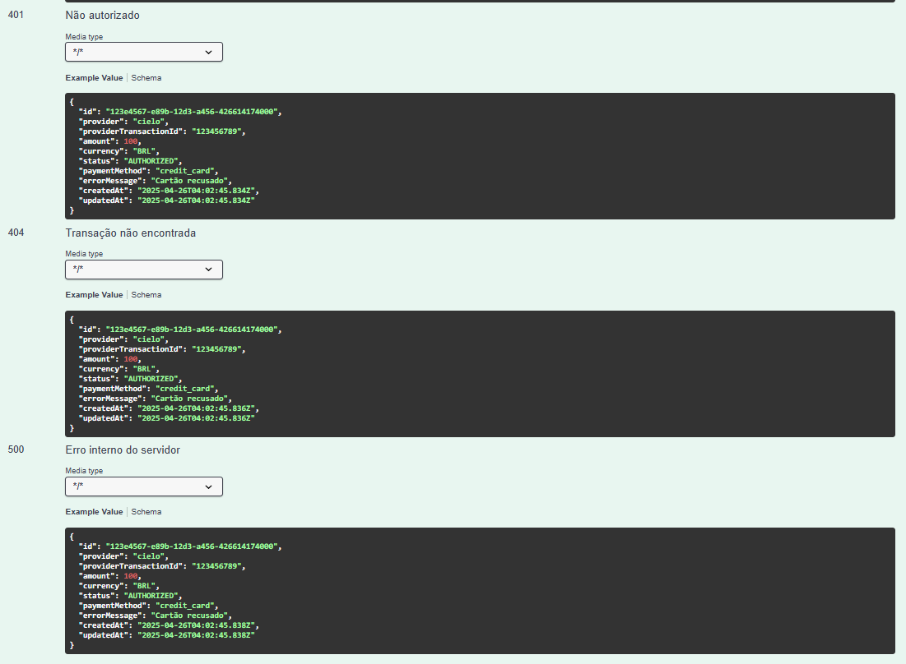
    <p><em>Respostas de erro para reembolso</em></p>
</div>

##### Consulta

<div style="text-align: center;">
    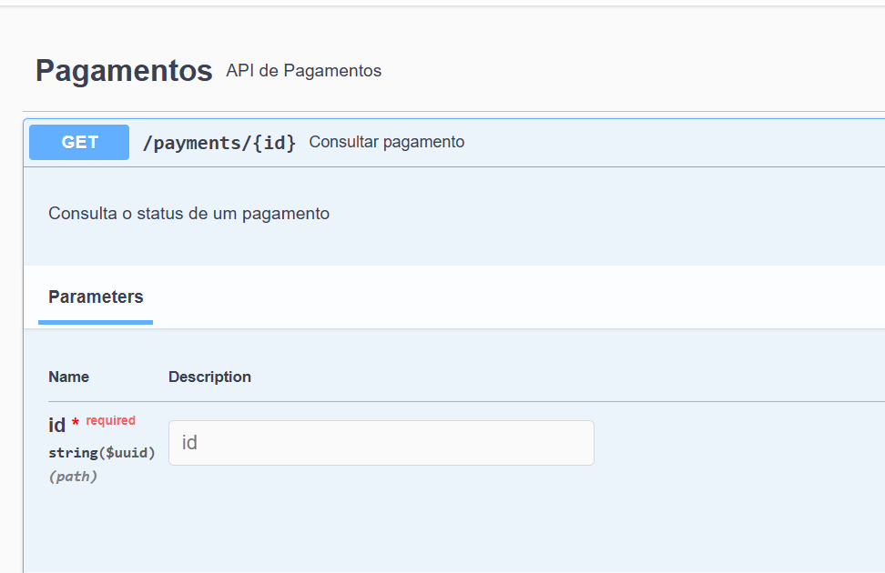
    <p><em>Endpoint para consulta de pagamento</em></p>
</div>

<div style="text-align: center;">
    
    <p><em>Respostas para consulta de pagamento</em></p>
</div>

### Schemas

#### Request

<div style="text-align: center;">
    
    <p><em>Schema para requisição de pagamento</em></p>
</div>

#### Response

<div style="text-align: center;">
    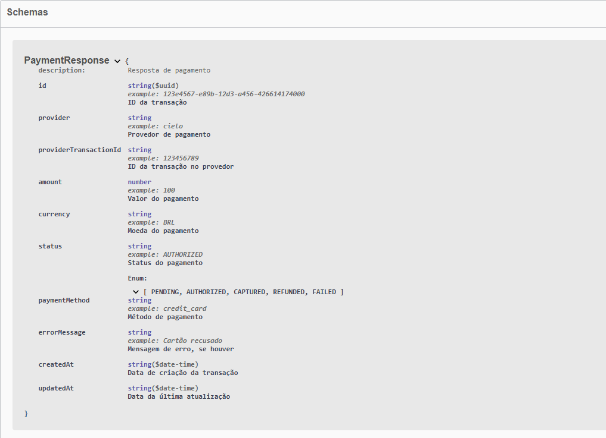
    <p><em>Schema para resposta de pagamento</em></p>
</div>

## Estrutura do Banco de Dados

O sistema utiliza um banco de dados PostgreSQL com as seguintes tabelas:

### 1. payment_transactions
Armazena todas as transações de pagamento.
- **Campos principais**:
  - `id` (UUID): Identificador único da transação
  - `provider` (VARCHAR): Provedor de pagamento (ex: stripe, cielo)
  - `provider_transaction_id` (VARCHAR): ID da transação no provedor
  - `amount` (DECIMAL): Valor da transação
  - `currency` (VARCHAR): Moeda (ex: BRL, USD)
  - `status` (VARCHAR): Status do pagamento
  - `payment_method` (VARCHAR): Método de pagamento
  - `raw_response` (TEXT): Resposta completa do provedor
  - `error_message` (TEXT): Mensagem de erro, se houver
  - `created_at` (TIMESTAMP): Data de criação
  - `updated_at` (TIMESTAMP): Data de atualização
  - `description` (VARCHAR): Descrição do pagamento
  - `customer_id` (VARCHAR): ID do cliente
  - `metadata` (TEXT): Metadados adicionais

### 2. customers
Armazena informações dos clientes.
- **Campos principais**:
  - `id` (UUID): Identificador único do cliente
  - `external_id` (VARCHAR): ID externo do cliente
  - `name` (VARCHAR): Nome do cliente
  - `email` (VARCHAR): Email do cliente
  - `document` (VARCHAR): Documento (CPF/CNPJ)
  - `phone` (VARCHAR): Telefone
  - `created_at` (TIMESTAMP): Data de criação
  - `updated_at` (TIMESTAMP): Data de atualização

### 3. credit_cards
Armazena cartões de crédito dos clientes.
- **Campos principais**:
  - `id` (UUID): Identificador único do cartão
  - `customer_id` (UUID): ID do cliente (FK)
  - `provider_card_id` (VARCHAR): ID do cartão no provedor
  - `last_four_digits` (VARCHAR): Últimos 4 dígitos
  - `brand` (VARCHAR): Bandeira do cartão
  - `expiration_month` (INTEGER): Mês de expiração
  - `expiration_year` (INTEGER): Ano de expiração
  - `is_default` (BOOLEAN): Cartão padrão
  - `created_at` (TIMESTAMP): Data de criação
  - `updated_at` (TIMESTAMP): Data de atualização

### 4. transaction_logs
Armazena histórico de alterações nas transações.
- **Campos principais**:
  - `id` (UUID): Identificador único do log
  - `transaction_id` (UUID): ID da transação (FK)
  - `status` (VARCHAR): Status registrado
  - `message` (TEXT): Mensagem do log
  - `created_at` (TIMESTAMP): Data de criação

### Índices
Para otimizar as consultas, foram criados os seguintes índices:
- `idx_payment_transactions_provider`: Índice no campo provider da tabela payment_transactions
- `idx_payment_transactions_status`: Índice no campo status da tabela payment_transactions
- `idx_payment_transactions_customer_id`: Índice no campo customer_id da tabela payment_transactions
- `idx_customers_external_id`: Índice no campo external_id da tabela customers
- `idx_credit_cards_customer_id`: Índice no campo customer_id da tabela credit_cards
- `idx_transaction_logs_transaction_id`: Índice no campo transaction_id da tabela transaction_logs

### Relacionamentos
- `credit_cards.customer_id` → `customers.id`
- `transaction_logs.transaction_id` → `payment_transactions.id`

### Diagrama MER

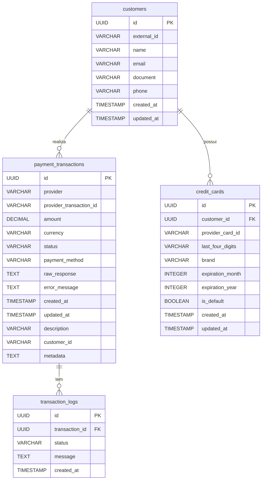

O diagrama acima representa:

1. **Entidades**:
   - `payment_transactions`: Transações de pagamento
   - `customers`: Clientes
   - `credit_cards`: Cartões de crédito
   - `transaction_logs`: Logs de transações

2. **Relacionamentos**:
   - Um cliente pode ter vários cartões de crédito (1:N)
   - Um cliente pode realizar várias transações (1:N)
   - Uma transação pode ter vários logs (1:N)

3. **Atributos**:
   - PK: Chave primária
   - FK: Chave estrangeira
   - Demais campos com seus respectivos tipos

4. **Cardinalidades**:
   - ||--o{ : Um para muitos (1:N)
   - ||--|| : Um para um (1:1)

## Arquitetura Atual

### Diagrama da Arquitetura

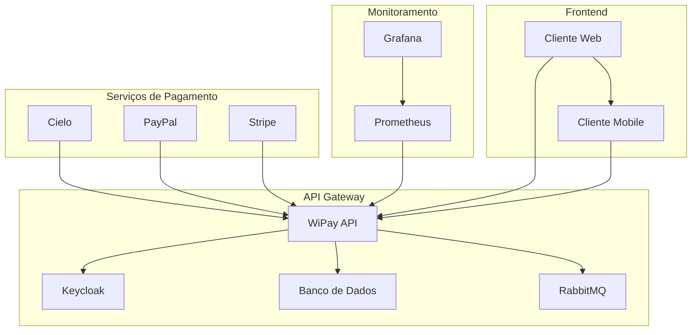

### Estrutura de Diretórios

```
java-api/
├── src/
│   └── main/
│       ├── java/
│       │   └── com/
│       │       └── wipay/
│       │           └── gateway/
│       │               ├── config/
│       │               │   ├── SecurityConfig.java
│       │               │   └── SwaggerConfig.java
│       │               ├── controller/
│       │               │   └── PaymentController.java
│       │               ├── dto/
│       │               │   ├── PaymentRequest.java
│       │               │   └── PaymentResponse.java
│       │               ├── model/
│       │               │   └── PaymentTransaction.java
│       │               ├── provider/
│       │               │   ├── CieloProvider.java
│       │               │   ├── PayPalProvider.java
│       │               │   └── StripeProvider.java
│       │               ├── repository/
│       │               │   └── PaymentTransactionRepository.java
│       │               ├── service/
│       │               │   └── PaymentService.java
│       │               └── GatewayApplication.java
│       └── resources/
│           ├── application.yml
│           ├── application-dev.yml
│           └── db/
│               └── migration/
│                   └── V1__create_tables.sql
├── keycloak/
│   ├── realm-export.json
│   └── keycloak-compose.yml
├── image-doc-wipay/
│   └── [arquivos de documentação visual]
├── .vscode/
│   └── [configurações do VS Code]
├── .idea/
│   └── [configurações do IntelliJ]
├── target/
│   └── [arquivos compilados]
├── .gitignore
├── .env.example
├── docker-compose.yml
├── Dockerfile
├── Endpoints.md
├── insomnia-config.json
├── pom.xml
├── prometheus.yml
└── sonar-project.properties
```

### Descrição da Arquitetura

O sistema atual segue uma arquitetura baseada em microsserviços com os seguintes componentes principais:

1. **Frontend**

   - Cliente Web (React/Angular)
   - Cliente Mobile (React Native/Flutter)

2. **API Gateway (WiPay)**

   - API REST desenvolvida em Java 17+
   - Documentação via Swagger
   - Endpoints para autorização, captura, reembolso e consulta de pagamentos
   - Integração com múltiplos gateways de pagamento

3. **Autenticação e Autorização**

   - Keycloak para gerenciamento de identidade
   - OAuth2/OpenID Connect
   - JWT para tokens de acesso
   - Roles e permissões configuráveis

4. **Banco de Dados**

   - PostgreSQL para dados principais
   - PostgreSQL para Keycloak
   - Migrações automáticas

5. **Message Broker**

   - RabbitMQ para comunicação assíncrona
   - Filas para processamento de pagamentos
   - Retry e dead letter queues

6. **Serviços de Pagamento**

   - Integração com Cielo
   - Integração com PayPal
   - Integração com Stripe
   - Padrão Strategy para diferentes providers

7. **Monitoramento**

   - Prometheus para métricas
   - Grafana para visualização
   - Logs estruturados
   - Alertas configuráveis

8. **Infraestrutura**
   - Docker para containerização
   - Docker Compose para orquestração
   - Ambiente de desenvolvimento isolado
   - CI/CD pipeline

A comunicação entre os componentes é feita via:

- HTTP/HTTPS para APIs REST
- AMQP para mensageria
- JWT para autenticação
- WebSockets para notificações em tempo real

Esta arquitetura permite:

- Alta disponibilidade
- Escalabilidade horizontal
- Segurança robusta
- Manutenibilidade
- Monitoramento efetivo
- Facilidade de deploy

## Segurança e Configuração

### Variáveis de Ambiente

O projeto utiliza variáveis de ambiente para configurações sensíveis. Nunca compartilhe ou comite o arquivo `.env`. Use o `.env.example` como referência:

1. Copie o arquivo `.env.example` para `.env`:
   ```bash
   cp .env.example .env
   ```

2. Edite o arquivo `.env` com suas configurações reais.

### Segurança

- Nunca comite arquivos `.env` ou com credenciais
- Use senhas fortes e únicas para cada ambiente
- Em produção, use um gerenciador de segredos
- Mantenha as chaves de API em segredo
- Use ambientes de sandbox para desenvolvimento
- Revogue e renove credenciais regularmente

### Configuração de Ambiente

1. **Banco de Dados**:
   - Configure `DB_*` variáveis no `.env`
   - Use senhas fortes
   - Em produção, use conexões seguras

2. **Keycloak**:
   - Configure `KEYCLOAK_*` variáveis
   - Use senhas fortes para admin
   - Configure realm e client adequadamente

3. **Provedores de Pagamento**:
   - Use sandbox para desenvolvimento
   - Configure `CIELO_*`, `PAYPAL_*`, `STRIPE_*`
   - Mantenha as chaves em segredo

4. **RabbitMQ**:
   - Configure `RABBITMQ_*` variáveis
   - Use credenciais seguras
   - Em produção, use conexões seguras

### Boas Práticas

1. **Desenvolvimento**:
   - Use ambientes de sandbox
   - Use credenciais de teste
   - Não comite arquivos `.env`

2. **Produção**:
   - Use gerenciador de segredos
   - Use conexões seguras
   - Monitore logs e acessos
   - Implemente rate limiting
   - Use HTTPS em todas as conexões

3. **Documentação**:
   - Mantenha `.env.example` atualizado
   - Documente processos de segurança
   - Mantenha logs de alterações
